## 📖 简介：

Java版，基于Java+Vue+Uni-app开发，在微信公众号、小程序、H5移动端都能使用，独立部署，二开很方便，还支持免费商用，能满足企业新零售、分销推广、拼团、砍价、秒杀等多种经营需求，自用、做二开项目都很合适。

独立部署、二开方便，适用于企业新零售、分销、拼团、砍价，秒杀等各种业务需求。

---

### 💡 系统亮点：
>1.SpringBoot 框架开发业界主流。   
>2.【前端】Web PC 管理端 Vue + Element UI。 
>3.【前端】移动端使用 Uni-app 框架，前后端分离开发。 
>4.标准RESTful 接口、标准数据传输，逻辑层次更明确，更多的提高api复用。 
>5.支持Redis队列，降低流量高峰，解除耦合，高可用。 
>6.数据导出，方便个性化分析。 
>7.数据统计分析,使用ECharts图表统计，实现用户、产品、订单、资金等统计分析。 
>8.Spring Security 权限管理，后台多种角色，多重身份权限管理，权限可以控制到按钮级别的操作。 
>9.Vue表单生成控件，拖拽配置表单，减少前端重复表单工作量，提高前端开发效率。 

---

### 💻 运行环境及框架：
~~~
1.	移动端uniapp开发框架 可生成H5 公众号 微信小程序
2.	WEB Pc 管理后台使用Vue + Element UI 开发 兼容主流浏览器 ie11+
3.	后台服务 Java SpringBoot + Mybatis-plus + Mysql + redis
4.	运行环境 linux和windows等都支持,只要有Java环境和对应的数据库 redis
5.	运行条件 Java 1.8 Mysql5.7
~~~
---

### 🔧 Java项目框架 和 WEB PC 项目运行环境
~~~
1. SpringBoot 2.2.6.RELEASE
2. Maven 3.6.1
3. swagger-bootstrap-ui 1.0
4. Mybatis Plus 3.3.1
5. npm 6
6. node 14
7. vue 2.x
8. element ui 2.13
~~~

---

### 🧭 项目代码包介绍
~~~
1. admin     WEB程序         PC端管理端 VUE + ElementUi
2. app       移动商城         UniApp标准开发(H5 + 微信小程序)
3. crmeb     Api            Java SpringBoot + mybatisPlus
4. 接口文档   Api对应的接口文档也可以部署项目后查看
~~~

移动端 uniapp 开发 使用 HbuilderX 开发

### 💟 UI界面
#### 核心功能
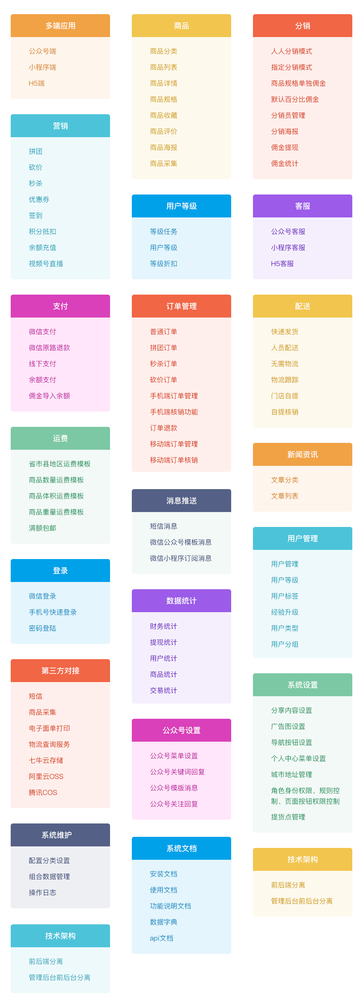

### 📱 移动端预览

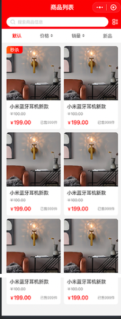

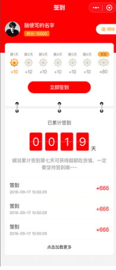
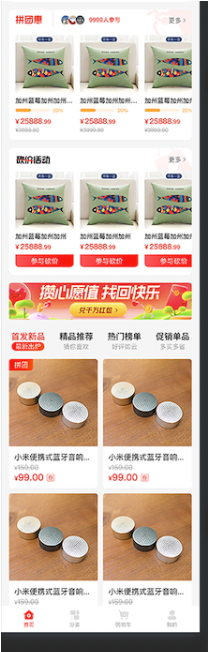
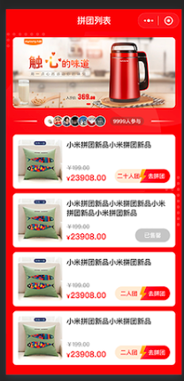

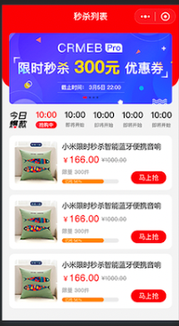

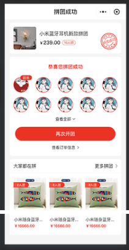
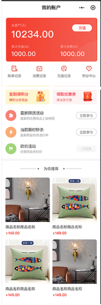
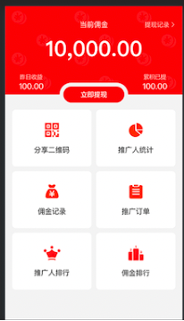
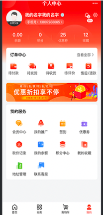
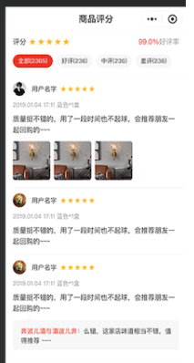

### WEB PC管理端预览

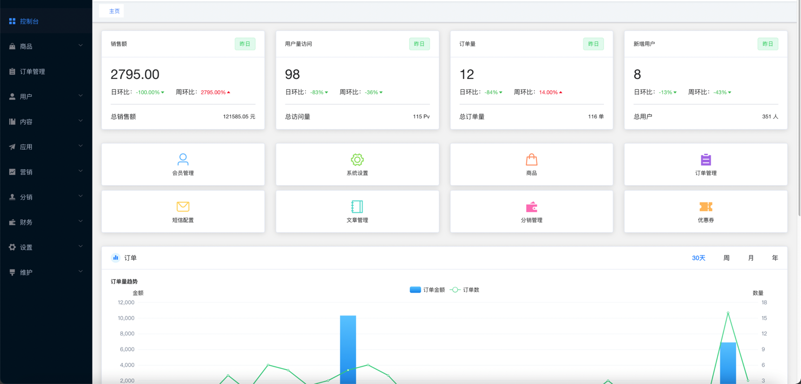
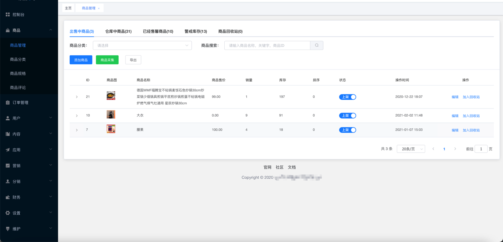
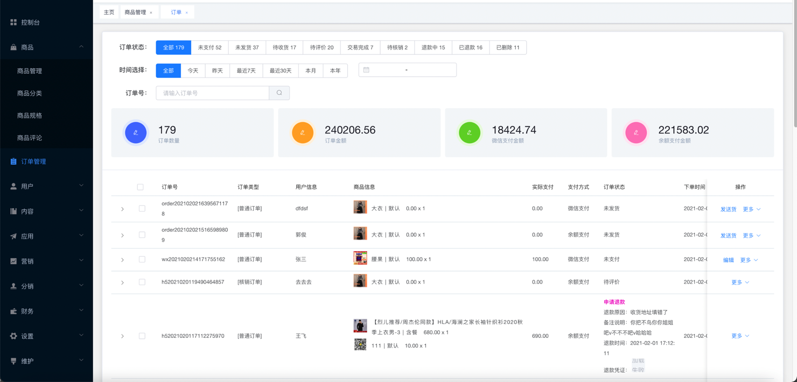
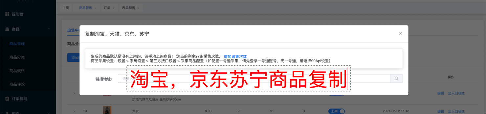
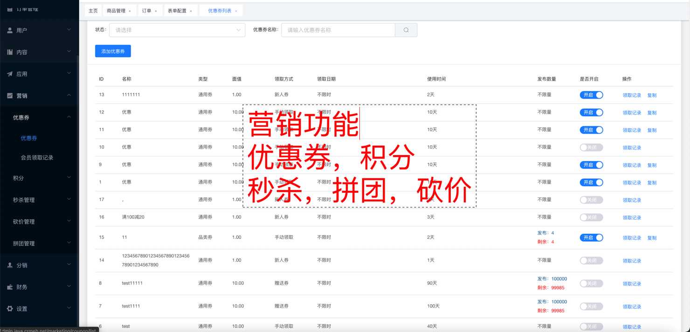
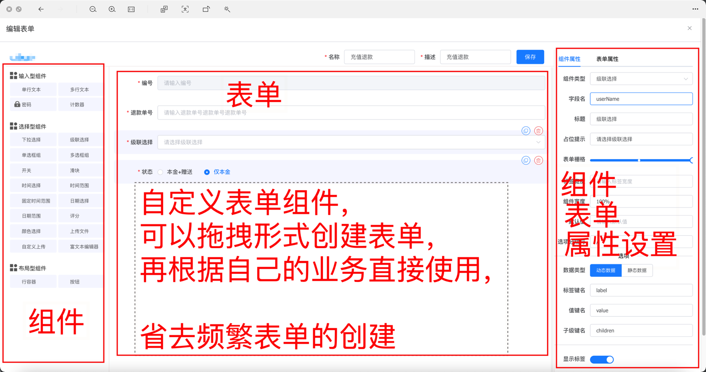
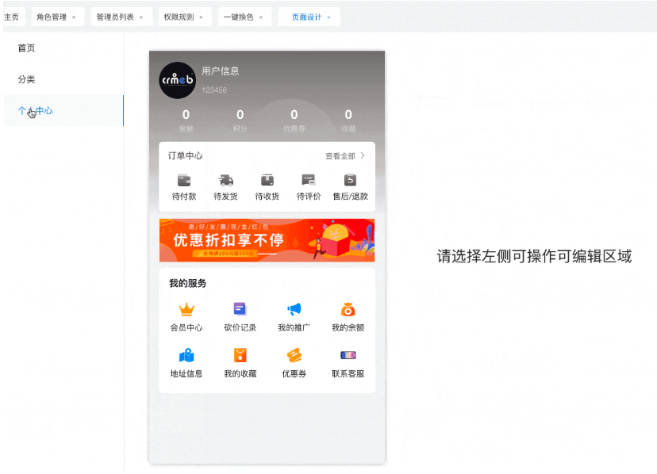
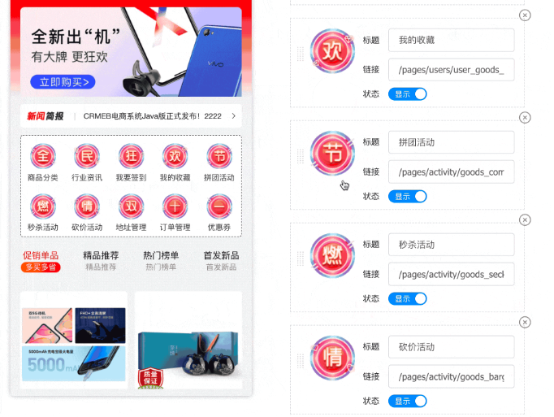
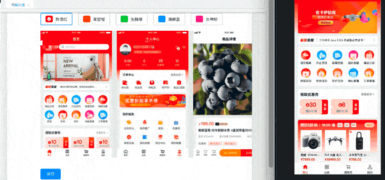
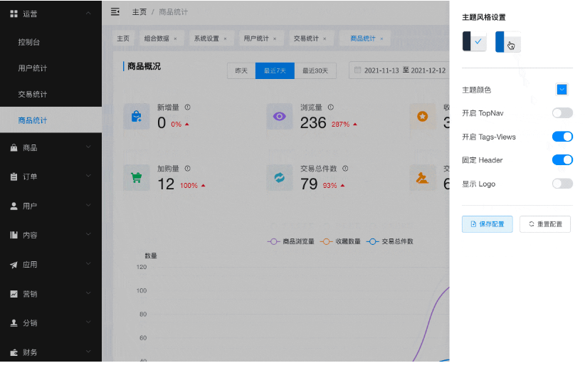

* Admin管理员 密码操作
* 密码加密
* 破解密码
* Redis测试操作
* 删除
* 新增
* 查询
* 企业微信消息推送
* gitlab钩子
* 消息推送
* 图片操作
* 合并图片返回文件
* 微信开放平台 -- 消息
* 接受微信推送过来的消息
* Admin 平台用户
* AdminUserLogin
* AdminUserLogout
* GetAdminUserByToken
* 获取登录页图片
* 上传文件
* 同步到云服务
* 图片上传
* 文件上传
* 会员 -- 分组
* 修改
* 分页列表
* 删除
* 新增
* 详情
* 会员 -- 标签
* 修改
* 分页列表
* 删除
* 新增
* 详情
* 会员 -- 等级
* 修改
* 分页列表
* 清除会员等级
* 会员管理
* 会员详情
* 会员详情页Top数据
* 修改
* 分组
* 分页列表
* 删除
* 标签
* 积分余额
* 详情
* 会员管理 -- 用户账单
* 修改
* 分页列表
* 删除
* 新增
* 详情
* 分类服务
* 修改
* 分页列表
* 删除
* 新增
* 根据id集合获取分类列表
* 获取tree结构的列表
* 详情
* 分销
* 分销列表
* 分销头部数据
* 分销管理信息保存
* 分销配置信息获取
* 根据条件获取推广人列表
* 根据条件获取推广人订单
* 添加推广关系
* 清除上级推广人
* 后台用户服务
* 修改
* 分页列表
* 删除
* 新增
* 详情
* 商品
* 上架
* 下架
* 修改
* 分页列表
* 删除
* 商品表头数量
* 导入商品
* 库存变动
* 新增
* 虚拟销量
* 详情
* 商品 -- 规则值(规格)
* 修改
* 分页列表
* 删除
* 新增
* 详情
* 商品 -- 评论
* 修改
* 分页列表
* 删除
* 回复
* 新增
* 详情
* 城市管理
* 修改
* 修改状态
* 分页列表
* 获取tree结构的列表
* 详情
* 客服用户对话记录表
* 分页列表
* 客服表
* 修改
* 分页列表
* 删除
* 新增
* 详情
* 导出 -- Excel
* 产品
* 微信 -- 消息模版
* 修改
* 修改
* 分页列表
* 删除
* 新增
* 行业信息
* 详情
* 微信开放平台 -- 小程序access_token
* 修改
* 分页列表
* 删除
* 新增
* 详情
* 微信开放平台 -- 小程序二维码管理
* 修改
* 分页列表
* 删除
* 新增
* 详情
* 微信开放平台 -- 微信二维码管理
* 修改
* 分页列表
* 删除
* 新增
* 详情
* 微信开放平台 -- 微信关键字回复
* 修改
* 分页列表
* 删除
* 新增
* 根据关键字查询数据
* 状态
* 详情
* 微信开放平台 -- 微信用户
* 消息推送
* 微信开放平台 -- 微信用户标签
* 修改
* 列表
* 创建
* 删除
* 批量为用户取消标签
* 批量为用户打标签
* 获取标签下粉丝列表
* 获取用户身上的标签列表
* 微信开放平台 -- 用户行为记录
* 修改
* 分页列表
* 删除
* 新增
* 详情
* 微信开放平台 -- 素材
* 上传
* 根据素材id查询素材
* 微信开放平台 -- 菜单管理
* 保存个性化菜单
* 保存自定义菜单
* 删除个性化菜单
* 删除自定义菜单
* 获取个性化菜单
* 获取自定义菜单
* 微信开放平台 -- 表单id表记录
* 修改
* 分页列表
* 删除
* 新增
* 详情
* 支付回调
* 微信支付回调
* 支付宝支付回调
* 文章管理
* 修改
* 分页列表
* 删除
* 新增
* 绑定产品
* 详情
* 短信服务
* 发送短信
* sendCodeForRegister
* 信息登录
* 是否已经登录
* 注销
* 申请模板消息
* 短信发送记录列表
* 短信提醒开关保存
* 短信提醒开关列表
* 短信模板列表
* 短信用户信息
* 获取支付套餐列表
* 获取支付码
* 账号注册
* 统计 -- 主页
* 30天订单量趋势
* 周订单量趋势
* 年订单量趋势
* 新增用户
* 月订单量趋势
* 用户曲线图
* 用户访问量
* 用户购买统计
* 订单量
* 销售额
* 营销 -- 优惠券
* 修改
* 分页列表
* 新增
* 详情
* 营销 -- 优惠券 -- 领取记录
* 分页列表
* 领券
* 订单
* 修改订单
* 分页列表
* 删除
* 发送货
* 备注
* 快递查询
* 拒绝退款
* 详情
* 退款
* 订单 -- 操作记录
* 修改
* 分页列表
* 删除
* 新增
* 详情
* 设置 -- Config
* 整体保存表单数据
* 检测表单name是否存在
* 表单配置中仅仅存储
* 表单配置根据key获取
* 详情
* 设置 -- 会员等级
* 修改
* 分页列表
* 删除
* 新增
* 是否使用
* 详情
* 设置 -- 会员等级 -- 等级任务
* 修改
* 分页列表
* 删除
* 新增
* 详情
* 设置 -- 提货点 -- 提货点
* 修改
* 修改门店显示状态
* 分页列表
* 删除
* 数量
* 新增
* 详情
* 设置 -- 提货点 -- 核销员
* 修改
* 修改状态
* 分页列表
* 删除
* 新增
* 详情
* 设置 -- 提货点 -- 核销订单
* 分页列表
* 设置 -- 权限管理 -- 身份管理
* TestMenu
* 修改
* 分页列表
* 删除
* 新增
* 菜单
* 详情
* 设置 -- 物流 -- 付费
* 根据模板id查询数据
* 设置 -- 物流 -- 免费
* 根据模板id查询数据
* 设置 -- 物流 -- 公司
* 修改
* 分页列表
* 删除
* 新增
* 详情
* 设置 -- 物流 -- 模板
* 修改
* 分页列表
* 删除
* 新增
* 详情
* 设置 -- 管理员操作记录
* 修改
* 分页列表
* 删除
* 新增
* 详情
* 设置 -- 组合数据
* 修改
* 分页列表
* 删除
* 新增
* 详情
* 设置 -- 组合数据 -- 详情
* 修改
* 分页列表
* 删除
* 新增
* 详情
* 设置 -- 表单模板
* 修改
* 分页列表
* 新增
* 详情
* 设置 -- 通知记录 -- 通知模板
* 修改
* 分页列表
* 删除
* 新增
* 详情
* 财务 -- 充值
* 分页列表
* 删除
* 提现总金额
* 财务 -- 提现申请
* 修改
* 分页列表
* 提现总金额
* 财务 -- 资金监控
* 佣金记录
* 资金监控
* 附件管理
* 修改
* 分页列表
* 删除
* 新增
* 更改图片目录
* 详情
* 验证码服务
* 检测验证码
* 获取验证码

